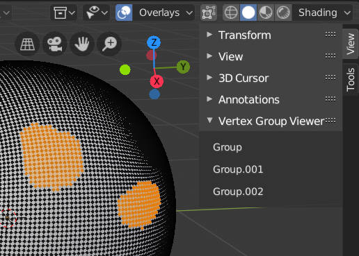

# Vertex Group Viewer

選択された頂点の頂点グループ名を表示する。  
Display vertex groups of selected vertices. 

対象の Blender バージョンは 2.80。しかし 2.79 でも動作するはず。  
Supported version is 2.80. But it would work in 2.79.

サイドバーの View > Vertex Group Viewer に表示される。  
Vertex groups is displayed in View tab in sidebar.

